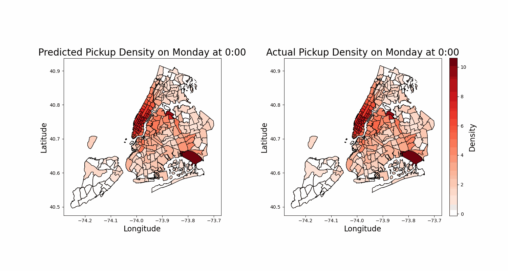

# nyc_taxi
A project that aims to predict the general destination of a passenger given initial information about their taxi trip.  

This work was created for submission as a final project in ACME Volume 3: Modeling Data and Uncertainty.  

# Animations

## Animation on all monday data
The first animation shows a comparison between our model's predictions and the true data on *all* data points. So to be clear, *some* data that was included as input to the model for predictions was also included in the training set of data.

## Animation on monday test data
This animation shows a comparison between our model's predictions and the true data on strictly test data points. So this figure is an appropriate measure of how the model was able to generalize to unseen data. 

